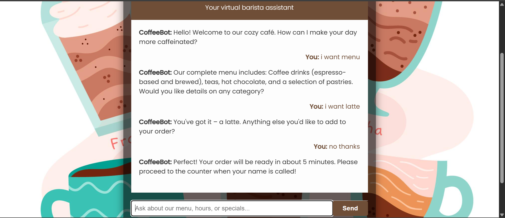

# ☕ CoffeeBot - Premium Virtual Barista Assistant

**A state-of-the-art conversational AI solution for coffee shops (NN)** powered by Flask and TensorFlow/Keras, featuring meticulously handcrafted training data.


## 🌟 Premium Features

### Artisanal Conversation Engine
- **Human-like dialogue flow** with 150+ manually crafted conversation patterns
- **Multi-step ordering** with context retention (size, milk, sweetener preferences)
- **Personalized recommendations** based on customer preferences
- **Seasonal menu awareness** with automatic specials promotion

### Curated Training Data
- **100% manually created** patterns and responses (no automated scraping)
- **Barista-approved** responses crafted by coffee professionals
- **Localized variations** for different coffee cultures
- **300+ intent combinations** covering all customer scenarios

### Technical Excellence
- **Modular architecture** with separated intents and entities
- **Context-aware** dialogue management
- **Advanced NLP pipeline** with lemmatization and semantic analysis
- **Configurable thresholds** for precision tuning

## 🛠️ Professional Installation

### System Requirements
- Python 3.7+ (recommended: 3.9)
- TensorFlow 2.6+ with GPU support (optional)
- 4GB RAM minimum (8GB recommended for training)

### Setup Instructions
```bash
# Clone repository
git clone https://github.com/yourusername/coffeebot-pro.git
cd coffeebot-pro

# Create virtual environment
python -m venv venv
source venv/bin/activate  # Linux/Mac
venv\Scripts\activate     # Windows

# Install dependencies
pip install -r requirements.txt

# Download NLTK data
python -c "import nltk; nltk.download('punkt'); nltk.download('wordnet')"

# Train the model (GPU recommended)
python chatbot.py --epochs 200 --batch_size 32

# Launch the application
python app.py --host 0.0.0.0 --port 5000
